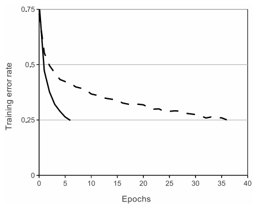

# <div align="center"> ImageNet Classification with Deep Convolutional Neural Networks </div>

<div align="center">
    Alex Krizhevsky, Ilya Sutskever, Geoffrey E. Hinton
    </br>
    </br>
    Advances in neural information processing systems 25(NIPS)-2012
</div>

</br>
</br>

paper : https://proceedings.neurips.cc/paper/2012/file/c399862d3b9d6b76c8436e924a68c45b-Paper.pdf

</br>

## 0. Abstract

> We trained a large, deep convolutional neural network to classify the 1.2 million high-resolution images in the ImageNet LSVRC-2010 contest into the 1000 different classes.

$\to$ ImageNet LSVRC-2010 이미지 분류 대회에서 1000개의 class를 가진 1200만개의 이미지를 분류하기 위해 깊은 convolution 신경망을 학습시켰다.

---

> On the test data, we achieved top-1 and top-5 error rates of 37.5% and 17.0% which is considerably better than the previous state-of-the-art.

$\to$ 우리 모델은 top-1, top-5 error rate 에서 37.5%, 17.0% 를 기록하며 SOTA 달성하였다.(top error rate : 모델이 예측한 상위 n개 데이터 중 정답이 없는 오류율)

---

> The neural network, which has 60 million parameters and 650,000 neurons, consists of five convolutional layers, some of which are followed by max-pooling layers, and three fully-connected layers with a final 1000-way softmax.

$\to$ 신경망은 6천만개의 파라미터와 65만개의 뉴런, max-pooling을 사용하기도 한 5개의 컨볼루션 층, 마지막 1000 가지를 분류하기 위한 3개의 FCN으로 구성되어있다.

---

> To reduce overfitting in the fully-connected layers we employed a recently-developed regularization method called “dropout” that proved to be very effective.

$\to$ 오버피팅을 줄이기 위해 FCN에 regularization 기법으로 효과적인 dropout을 적용하였다.

---

**SMRY : ImageNet LSVRC-2010 대회에서 SOTA를 달성. convolution layer를 사용하고 max-pooling, dropout 등을 사용함. GPU로 학습시킴.**

</br>

## 1. Introduction

> Until recently, datasets of labeled images were relatively small.

$\to$ 최근까지도, 라벨링 된 데이터 셋은 상대적으로 적었다.

---

> Simple recognition tasks can be solved quite well with datasets of this size, ~. But objects in realistic settings exhibit considerable variability, so to learn to recognize them it is necessary to use much larger training sets.

$\to$ 간단한 구분 작업은 적은 데이터 셋으로도 쉽게 가능하지만, 현실 세계의 사물들은 상당히 다양하므로 그들을 구분하는 것은 훨씬 더 많은 training datasets을 필요로 한다.

---

> The new larger datasets include LabelMe, which consists of hundreds of thousands of fully-segmented images, and ImageNet, which consists of over 15 million labeled high-resolution images in over 22,000 categories.

$\to$ 수십만 개의 fully-segmented 이미지로 이루어진 LabelMe, 1500 만개 이상, 22000 개가 넘는 카테고리의 높은 해상도의 이미지의 ImageNet 과 같은 데이터셋이 최근에야 만들어짐.

---

> To learn about thousands of objects from millions of images, we need a model with a large learning capacity.

$\to$ 수백만 개의 이미지로 부터 학습하려면, 모델이 매우 커야 한다.

---

>  However, the immense complexity of the object recognition task means that this problem cannot be specified even by a dataset as large as ImageNet, so our model should also have lots of prior knowledge to compensate for all the data we don’t have. 

$\to$ 하지만 매우 복잡한 객체 인식 작업은 단순히 방대한 데이터만 있어서는 안되며, 모델이 우리가 가지고 있지 않은 데이터에 대해서도 사전 지식이 필요하다.(데이터만으로는 문제를 극복할 수 없고, 모델에서도 극복해야할 문제가 있다는 의미정도로 이해)

---

> Convolutional neural networks(CNNs) constitute one such class of models.

$\to$ CNN 이 위의 문제를 어느정도 해결해주는 모델 구조 중 하나이다.

---

> Their capacity can be controlled by varying their depth and breadth, and they also make strong and mostly correct assumptions about the nature of imagess (namely, stationarity of statistics and locality of pixel dependencies).

$\to$ CNN 은 크기를 다양하게 조절할 수 있고, 자연의 이미지에 대해서 잘 작동한다.

---

> Thus, compared to standard feedforward neural networks with similarly-sized layers, CNNs have much fewer connections and parameters and so they are easier to train, while their theoretically-best performance is likely to be only slightly worse.

$\to$ 일반적인 FFN과 비교하면 비슷한 크기의 층을 가지고 있을 때, 최고 성능은 약간 떨어지더라도 CNN은 훨씬 더 적은 파라미터를 가지므로 학습하기 더 쉽다.

---

> Despite the attractive qualities of CNNs, ~, they have still been prohibitively expensive to apply in large scale to high-resolution images.

$\to$ 이러한 CNN의 매력적인 성질에도 불구하고, 고화질의 이미지에 대해서 계산량이 매우 크다.

Q : 학습이 쉬운 것이랑 학습에 드는 비용이 큰 것이랑은 다른 문제인가? (학습이 쉽다는 것은 backprop 하는 과정에서 큰 문제가 없다는 것, 학습 비용이 크다는 것은 컴퓨팅 자원이 많이 필요한 것으로 이해?) 

---

> Luckily, current GPUs, ~, are powerful enough to facilitate the training of interestingly-large CNNs, ~.

$\to$ 다행이도, 현재 GPU는 거대한 CNN을 훈련시킬 수 있을 만큼 좋아졌다.

---

> The specific contributions of this paper are as follows:
> 1. We trained one of the largest convolutional neural networks ~ and achieved by far the best results ever reported on these datasets.
> 2. Our network contains a number of new and unusual features which improve its performance and reduce its training time, which are detailed in Section 3.
> 3. The size of our network made overfitting a significant problem, even with 1.2 million labeled training examples, so we used several effective techniques for preventing overfitting, which are described in Section 4.
> 4. We found that removing any convolutional layer (each of which contains no more than 1% of the model's parameters) resulted in inferior performance.

$\to$ 이 논문의 기여는 다음과 같다.
1. 가장 큰 convolution neural network 를 학습시켰고, 대회에서 SOTA 달성.
2. 학습시간을 단축시키고 성능을 향상시키는 새롭고 특이한 다양한 방법들을 사용.
3. 몇몇 효과적인 테크닉을 사용해 overfitting 을 막음.
4. layer 의 깊이가 중요하다는 것을 알아냄. 전체 모델 파라미터의 1%도 되지 않는 convolution 층을 하나라도 제거하면 성능이 하락하는 것을 관찰함.

---

> Our network takes between five and six days to train on two GTX 580 3GB GPUs.

$\to$ GTX 580 3GB 두대로 5~6 일 동안 학습함.

---

**SMRY : 성능향상에는 많은 데이터, 모델의 크기, overfitting 을 막기위한 여러 방법들이 중요함. ImageNet 으로 데이터 확보, CNN 을 사용하여 모델을 키움(적은 파라미터), 여러 테크닉 사용하여 overfitting 을 예방.**

</br>

## 2. The Dataset

> ImageNet is a dataset of over 15 million labeled high-resolution images belonging to roughly 22,000 categories.

$\to$ ImageNet 은 약 22,000 개의 카테고리가 대략 1500만 개 정도인 고해상도 이미지 데이터 셋이다.

---

> The images were collected from the web and labeled by human labelers using Amazon’s Mechanical Turk crowd-sourcing tool.

$\to$ 이미지는 웹에서 가져왔으며 크라우드 소싱을 통해 사람이 라벨링 하였다.

---

> On ImageNet, it is customary to report two error rates: top-1 and top-5, where the top-5 error rate is the fraction of test images for which the correct label is not among the five labels considered most probable by the model.

$\to$ ImageNet 에서 주로 쓰이는 두가지 error rates 에는 top-1, top-5 이 있다. : top-n 은 모델이 예측한 top-n 개의 라벨 중, 정답이 존재하지 않는 비율이다.

---

> ImageNet consists of variable-resolution images, while our system requires a constant input dimensionality.

$\to$ ImageNet 은 이미지 해상도가 다양하지만 모델은 일정 크기의 입력만 받을 수 있다.

---

> Therefore, we down-sampled the images to a fixed resolution of 256 × 256.

$\to$ 그래서 256 × 256 크기로 down-sampling 했다.

---

> Given a rectangular image, we first rescaled the image such that the shorter side was of length 256, and then cropped out the central 256×256 patch from the resulting image.

$\to$ 직사각형 크기의 이미지는 짧은 부분을 256 크기로 먼저 맞춘 후, 가운데를 기준으로 256 × 256 크기로 만들었다.

---

**SMRY : ImageNet 은 사람이 라벨링한 약 1500 만개의 데이터 셋이다. 모델은 입력을 일정 크기로만 받기 때문에 이미지의 크기를 조정해준 후 입력값으로 주었다.**

</br>

## 3. The Architecture

> It contains eight learned layers — five convolutional and three fully-connected.

$\to$ 모델은 8개의 학습된 층으로 이루어져있다. - 5개의 convolution 층과 3개의 FCN.

</br>

### 3-1. ReLU Nonlinearity

> In terms of training time with gradient descent, these saturating nonlinearities are much slower than the non-saturating nonlinearity f(x) = max(0, x).

$\to$ gradient descent 를 통해 학습할 때 걸리는 시간을 보면, saturating nonlinearities(sigmoid, tanh) 함수들은 non-saturating nonlinearity 함수인 max(0, x) 보다 많이 느리다.

Q : saturating/non-saturating 의 기준은 무엇?

---

>  Following Nair and Hinton, we refer to neurons with this nonlinearity as Rectified Linear Units (ReLUs).

$\to$ Nair 와 Hinton 을 따라 우리는 이러한 nonlinearity 함수를 Rectified Linear Units(ReLUs) 라고 한다.

---

> This is demonstrated in Figure 1, which shows the number of iterations required to reach 25% training error on the CIFAR-10 dataset for a particular four-layer convolutional network.

$\to$ Figure 1 에 ReLU(solid line) 와 tanh(dashed line) 가 training error 25% 까지 도달하는데 걸리는 epoch 을 실험한 것을 나타내었다. 

<p align="center">
    
</p>

</br>

### 3-2. Training on Multiple GPUs

> It turns out that 1.2 million training examples are enough to train networks which are too big to fit on one GPU. Therefore we spread the net across two GPUs.

$\to$ 120만 개의 학습데이터는 모델을 학습하기에는 충분하지만, 너무 커서 하나의 GPU 로는 불가능하다. 따라서 두 대의 GPU를 사용하였다.

---

>  The parallelization scheme that we employ essentially puts half of the kernels (or neurons) on each GPU, with one additional trick: the GPUs communicate only in certain layers.

$\to$ 뉴런의 절반을 각 GPU에 나누어 학습을 진행했고 특정 층에서 GPU 간 연결을 해주는 식으로 병렬화를 진행하였다.

---

> This means that, for example, the kernels of layer 3 take input from all kernel maps in layer 2. However, kernels in layer 4 take input only from those kernel maps in layer 3 which reside on the same GPU.

$\to$ 예를 들어, 세 번째 층에서는 두 번째 층으로 부터 모든 입력값을 받지만, 네 번째 층에서는 같은 GPU에 있는 세 번째 층에서의 입력값만을 받습니다.

---

> Choosing the pattern of connectivity is a problem for cross-validation, but this allows us to precisely tune the amount of communication until it is an acceptable fraction of the amount of computation.

$\to$ GPU 간 연결 방식을 선택하는 것은 계산량이 허용되는 부분까지 정확하게 계산해 낼 수 있습니다.(하나의 GPU 가 가능한 계산량을 알아내어 조절해 준다는 말)

---

> This scheme reduces our top-1 and top-5 error rates by 1.7% and 1.2%, respectively, as compared with a net with half as many kernels in each convolutional layer trained on one GPU.

$\to$ 이 방법은 한 대의 GPU를 사용하여 학습을 진행했을 때 보다 top-5, top-1 error rates 를 각각 1.7%, 1.2% 낮추었다.

---

> The two-GPU net takes slightly less time to train than the one-GPU net.

$\to$ 두 대의 GPU 는 한 대의 GPU 를 사용했을 때 보다 학습시간도 감소하였다.

---

</br>

### 3-3. Local Response Normalization

> We still find that the following local normalization scheme aids generalization.

$\to$ local normalization 이 generalization 성능을 도와준다는 것을 발견했다.

---

> We applied this normalization after applying the ReLU nonlinearity in certain layers.

$\to$ 우리는 Local Response Normalization 을 특정 층에서 ReLU 함수 뒤에 적용하였다.

---

> Response normalization reduces our top-1 and top-5 error rates by 1.4% and 1.2%, respectively. We also verified the effectiveness of this scheme on the CIFAR-10 dataset: a four-layer CNN achieved a 13% test error rate without normalization and 11% with normalization.

$\to$ Response normalization 은 top-1 과 top-5 error rates 를 각각 1.4%, 1.2% 감소시켰다. 같은 방법을 가지고 CIFAR-10 데이터 셋에 대해서도 효과적이라는 것을 확인했다 : 4층의 CNN 에 대해서 normalization 을 적용하지 않았을 때는 13% 의 error rate, 적용했을 때는 11% 의 error rate 를 달성했다.

---

\<Local Response Normalization expression>

```math
b_{x, y}^{i} = a_{x, y}^{i} / \left k + \alpha \sum_{j=max(0, i-n/2)}^{min(N-1, i+n/2)}{(a_{x, y}^{j})^{2} \right ^\beta
```

</br>

### 3-4. Overlapping Pooling

> Pooling layers in CNNs summarize the outputs of neighboring groups of neurons in the same kernel map.

$\to$ CNN 에서 Pooling layer 는 같은 kernel map 안에 있는 인접한 뉴런들의 결과값들을 요약해준다.

---

> Traditionally, the neighborhoods summarized by adjacent pooling units do not overlap.

$\to$ 전통적으로 pooling layer 는 overlap 하지 않았다.

---

> If we set s < z, we obtain overlapping pooling. This is what we use throughout our network, with s = 2 and z = 3. (s: stride, z: kernel size)

$\to$ 만약 stride 를 pooling kernel size 보다 작게 설정한다면, 우리는 overlapping pooling 을 얻을 수 있고 우리의 network 에서 s=2, z=3 으로 사용했다.

---

> This scheme reduces the top-1 and top-5 error rates by 0.4% and 0.3%, respectively, as compared with the non-overlapping scheme s = 2, z = 2, which produces output of equivalent dimensions.

$\to$ 이 방법은 s=2, z=2 를 주어 overlapping 을 하지 않았을 때와 비교했을 때, top-1, top-5 error rate 를 각각 0.4%, 0.3% 감소시켰다.

---

> We generally observe during training that models with overlapping pooling find it slightly more difficult to overfit.

$\to$ 우리는 overlapping pooling 을 적용한 모델이 학습과정 중에 overfit 되기가 더 힘들다는 것을 관찰했다.

---

</br>

### 3-5. Overall Architecture

> As depicted in Figure 2, the net contains eight layers with weights; the first five are convolutional and the remaining three are fullyconnected.

$\to$ Figure 2 에서 처럼, 모델은 다섯개의 convolutional 층과 세개의 fcn 으로 구성되어있다.

---

> The output of the last fully-connected layer is fed to a 1000-way softmax which produces a distribution over the 1000 class labels.

$\to$ fcn 의 마지막 결과는 1000 개의 클래스 라벨들을 분류하기 위해 1000 개의 값이 softmax 에 주어진다.

---

> The kernels of the second, fourth, and fifth convolutional layers are connected only to those kernel maps in the previous layer which reside on the same GPU.

$\to$ 2, 4, 5 번째 convolutional 층은 오직 같은 GPU 에 있는 이전 층의 kernel map 과 연결된다.

---

